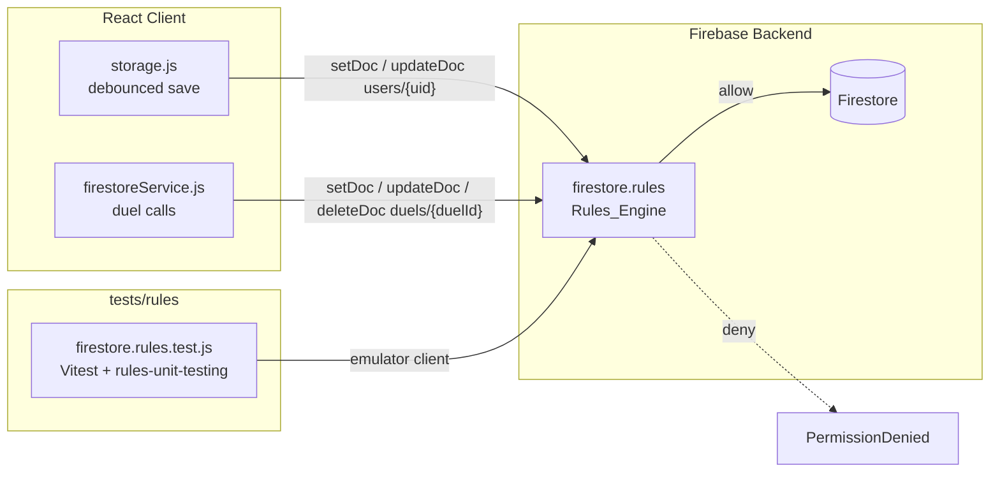
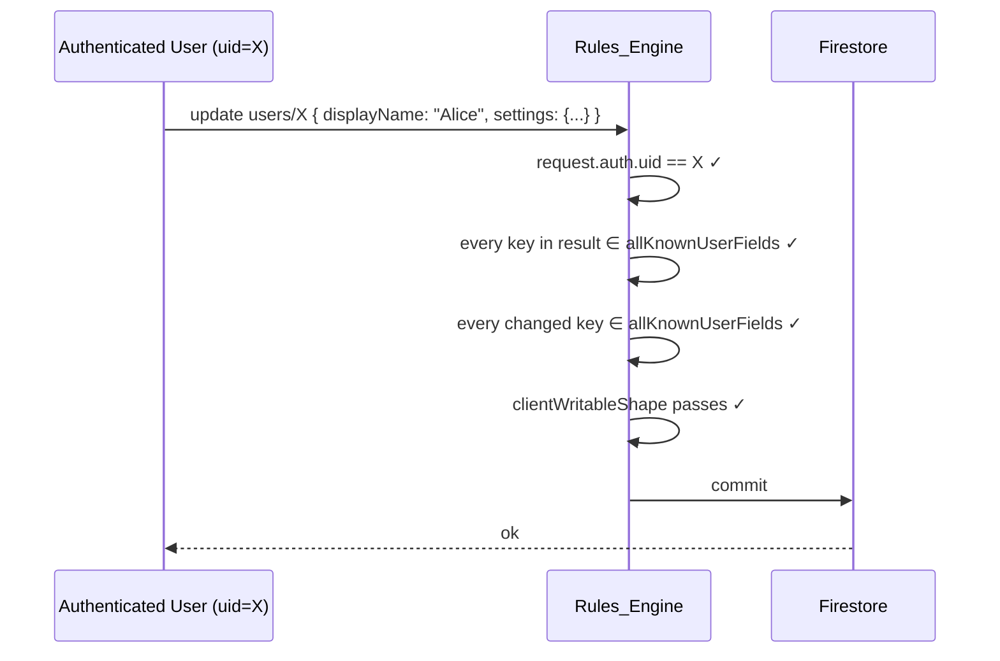
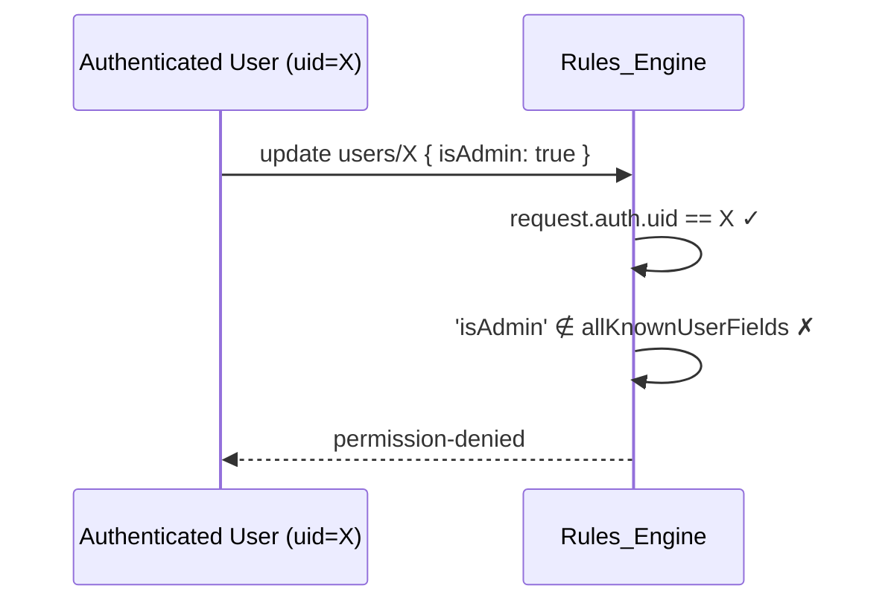
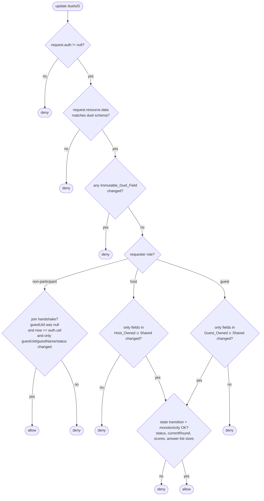
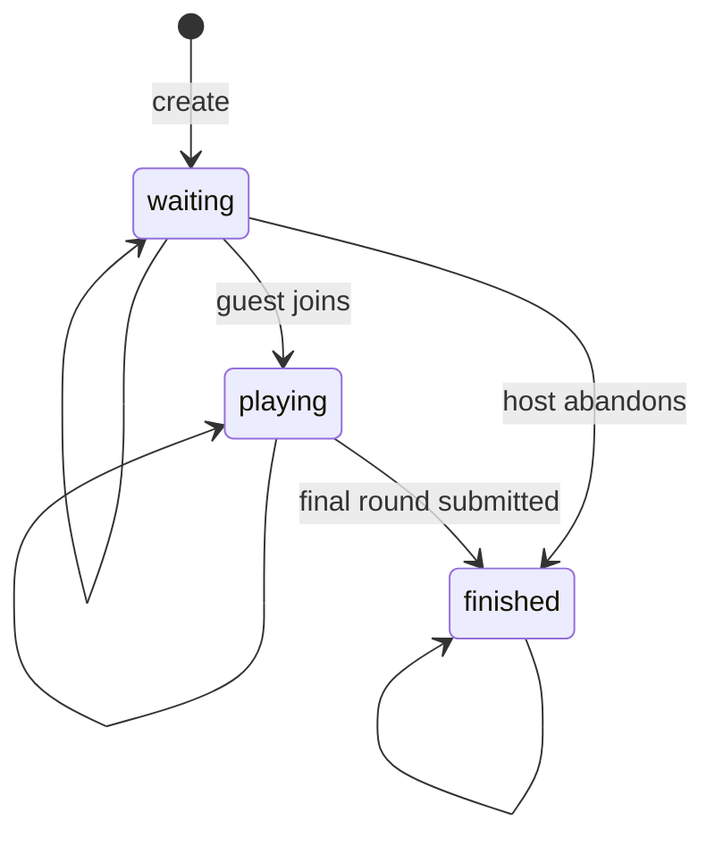

# Design Document: Firestore Rules Hardening

## Overview

The current `firestore.rules` is permissive in two consequential ways:

1. `users/{userId}` allows the owner to write *any* field, including XP, level, achievements, and survival/speed bests — fields that determine leaderboard ranking.
2. `duels/{duelId}` allows *any* authenticated user to update *any* field of *any* duel — opponents, bystanders, or attackers can rewrite scores, swap question sets, or replay finished games.

This design closes those gaps inside `firestore.rules` alone, with no Cloud Functions and no change to the Firestore data model. It does so by:

- Splitting user-doc fields into a small **client-writable** set and an explicit **integrity** set, then enforcing field-by-field write authorization on every update.
- Splitting duel fields into **host-owned**, **guest-owned**, **shared**, and **immutable** sets, plus a typed schema for create and update.
- Encoding the duel state machine (status transitions, monotonic `currentRound`, monotonic scores) as predicates the rules engine evaluates on every update.
- Adding an emulator-driven rules test suite (Vitest + `@firebase/rules-unit-testing`) so the gaps stay closed.

This iteration explicitly chooses the **Documented_Tradeoff_Path** for integrity-field writes (see [Integrity-Write Path Decision](#integrity-write-path-decision)). The rules still tighten meaningfully — owner-only access, no unknown fields, type/range validation — but a sophisticated authenticated user retains the ability to overwrite their own XP. That residual risk is documented and a migration path to a Cloud-Functions-based recompute is recorded for a future spec.

Rate limiting on duel creation is deferred to the planned Firebase App Check spec; rules-side rate limiting is rejected as infeasible without an auxiliary counter doc and a query inside rules. See [Rate-Limiting Decision](#rate-limiting-decision).

## Architecture

### Component view



The Rules_Engine is the single point of enforcement. The client never sees the rules — it sees only `permission-denied` errors when a write is rejected. The test suite drives the same Rules_Engine through the emulator, with no live Firebase project required.

### Allowed user-doc update flow



### Denied user-doc update flow



> Under the **Documented_Tradeoff_Path** chosen for this iteration, an update like `{ xp: 999999 }` is *allowed* by rules — `xp` is a known field, no unknown field is added, and the change is to the requester's own doc. This is the documented residual risk. See [Integrity-Write Path Decision](#integrity-write-path-decision). The rules-side denial flow shown above demonstrates the change that *is* enforced now: rejection of unknown-field injection.

### Duel update authorization decision



### Duel status state machine



Any other transition (e.g. `finished → playing`, `playing → waiting`) is rejected.

## Components and Interfaces

### `firestore.rules` — proposed content

The full proposed content of `firestore.rules` is below. The structure uses helper functions at the top of each `match` block, then narrows per-operation (`allow create`, `allow update`, `allow delete`, `allow read`). All quantification over fields uses `request.resource.data.diff(resource.data).affectedKeys()`, which is the supported way to test "which fields are changing".

```javascript
rules_version = '2';

service cloud.firestore {
  match /databases/{database}/documents {

    // ============================================================
    // Helpers
    // ============================================================
    function isAuthed() {
      return request.auth != null;
    }

    function isSelf(userId) {
      return isAuthed() && request.auth.uid == userId;
    }

    // ============================================================
    // users/{userId}
    // ============================================================
    match /users/{userId} {

      // --- field-set helpers ---
      function clientWritableFields() {
        return [
          'displayName', 'settings', 'dailyGoal', 'missed',
          'theme', 'sound', 'activeGame', 'updatedAt', 'createdAt'
        ];
      }

      function integrityFields() {
        return [
          'xp', 'level', 'title',
          'totalAnswered', 'totalCorrect', 'streak',
          'survivalBest', 'speedBest',
          'achievements', 'sessions', 'questionStats',
          'levelUp', 'dailyProgress', 'qotdHistory', 'dailyGoalDays'
        ];
      }

      function allKnownUserFields() {
        return clientWritableFields().concat(integrityFields());
      }

      function changedKeys() {
        return request.resource.data.diff(resource.data).affectedKeys();
      }

      function noUnknownFieldsOnCreate() {
        // Every key in the new doc must be a known user field.
        return request.resource.data.keys().hasOnly(allKnownUserFields());
      }

      function integrityFieldsValid() {
        // Documented_Tradeoff_Path: integrity fields are still client-writable
        // for this iteration. The migration to Server_Recompute_Path will
        // replace this predicate with `!changedKeys().hasAny(integrityFields())`
        // once writes move to a Cloud Function.
        //
        // What we *do* enforce now: every changed key must be a *known* field
        // (no unknown / unscoped field injection). The "no unknown fields"
        // guarantee for the new doc state as a whole is enforced separately by
        // the `keys().hasOnly(allKnownUserFields())` clause on `allow update`.
        return changedKeys().hasOnly(allKnownUserFields());
      }

      function integrityFieldsAtDefaults() {
        // On create, integrity fields, if present, must equal documented defaults.
        let d = request.resource.data;
        return
          (!('xp' in d) || d.xp == 0) &&
          (!('level' in d) || d.level == 1) &&
          (!('title' in d) || d.title == 'Beginner') &&
          (!('totalAnswered' in d) || d.totalAnswered == 0) &&
          (!('totalCorrect' in d) || d.totalCorrect == 0) &&
          (!('survivalBest' in d) || d.survivalBest == 0) &&
          (!('speedBest' in d) || d.speedBest == 0) &&
          (!('dailyGoalDays' in d) || d.dailyGoalDays == 0) &&
          (!('achievements' in d) || d.achievements.size() == 0) &&
          (!('sessions' in d) || d.sessions.size() == 0);
      }

      function clientWritableShape() {
        let d = request.resource.data;
        return
          (!('displayName' in d) || (d.displayName is string && d.displayName.size() <= 60)) &&
          (!('dailyGoal' in d) || (d.dailyGoal is int && d.dailyGoal >= 0 && d.dailyGoal <= 1000)) &&
          (!('theme' in d) || d.theme is string) &&
          (!('sound' in d) || d.sound is bool) &&
          (!('settings' in d) || d.settings is map) &&
          (!('missed' in d) || d.missed is list) &&
          (!('activeGame' in d) || d.activeGame == null || d.activeGame is map);
      }

      // --- read ---
      // Owner can always read their own doc. Any authenticated user may read
      // any user doc; this is required for leaderboard queries which are
      // ordered by xp/survivalBest/speedBest and limited to <=50 results.
      // The 50-result cap is enforced client-side in firestoreService.js
      // (rules cannot inspect query.limit reliably across SDK versions).
      allow read: if isAuthed();

      // --- create ---
      // Only the owning user may create their own doc, and only with known
      // fields, with integrity fields (if present) at default values.
      allow create: if isSelf(userId)
        && noUnknownFieldsOnCreate()
        && integrityFieldsAtDefaults()
        && clientWritableShape();

      // --- update ---
      // Only the owner; only known fields appear in the result; client-writable
      // fields are shape-validated. Under the Documented_Tradeoff_Path,
      // integrity fields remain client-writable; the migration to
      // Server_Recompute_Path will tighten `integrityFieldsValid` to
      // `!changedKeys().hasAny(integrityFields())`.
      allow update: if isSelf(userId)
        && integrityFieldsValid()
        && request.resource.data.keys().hasOnly(allKnownUserFields())
        && clientWritableShape();

      // --- delete ---
      allow delete: if isSelf(userId);
    }

    // ============================================================
    // duels/{duelId}
    // ============================================================
    match /duels/{duelId} {

      // --- field-set helpers ---
      function duelSchemaFields() {
        return [
          'hostUid', 'hostName', 'hostScore', 'hostAnswers', 'hostReady',
          'guestUid', 'guestName', 'guestScore', 'guestAnswers', 'guestReady',
          'questions', 'currentRound', 'totalRounds', 'status', 'createdAt'
        ];
      }

      function hostOwned()  { return ['hostScore', 'hostAnswers', 'hostReady']; }
      function guestOwned() { return ['guestScore', 'guestAnswers', 'guestReady']; }
      function sharedOwned(){ return ['currentRound', 'status']; }
      function joinFields() { return ['guestUid', 'guestName', 'status']; }

      function immutableFields() {
        // hostUid, hostName, questions, totalRounds, createdAt always immutable.
        // guestUid and guestName are immutable *after* first being set non-null;
        // that case is handled separately in the join handshake.
        return ['hostUid', 'hostName', 'questions', 'totalRounds', 'createdAt'];
      }

      function changedDuelKeys() {
        return request.resource.data.diff(resource.data).affectedKeys();
      }

      // --- role helpers ---
      function isHost() {
        return isAuthed() && resource.data.hostUid == request.auth.uid;
      }

      function isGuest() {
        return isAuthed()
          && resource.data.guestUid != null
          && resource.data.guestUid == request.auth.uid;
      }

      function isParticipant() { return isHost() || isGuest(); }

      // True iff every key in `keys` keeps the same value between old and new.
      function onlyChanged(allowed) {
        return changedDuelKeys().hasOnly(allowed);
      }

      // --- shape validation ---
      function isCreateShapeValid() {
        let d = request.resource.data;
        return
          d.keys().hasOnly(duelSchemaFields())
          && d.keys().hasAll(['hostUid', 'hostName', 'hostScore', 'hostAnswers', 'hostReady',
                              'guestUid', 'guestName', 'guestScore', 'guestAnswers', 'guestReady',
                              'questions', 'currentRound', 'totalRounds', 'status', 'createdAt'])
          && d.hostUid is string && d.hostUid == request.auth.uid
          && d.hostName is string && d.hostName.size() >= 1 && d.hostName.size() <= 40
          && d.hostScore == 0
          && d.hostAnswers is list && d.hostAnswers.size() == 0
          && d.hostReady == false
          && d.guestUid == null
          && d.guestName == null
          && d.guestScore == 0
          && d.guestAnswers is list && d.guestAnswers.size() == 0
          && d.guestReady == false
          && d.questions is list && d.questions.size() >= 1 && d.questions.size() <= 100
          && d.currentRound == 0
          && d.totalRounds is int && d.totalRounds == d.questions.size()
          && d.status == 'waiting'
          && d.createdAt == request.time;
      }

      function isUpdateShapeValid() {
        let d = request.resource.data;
        let total = resource.data.totalRounds;
        return
          d.keys().hasOnly(duelSchemaFields())
          && (!('hostScore'    in d) || (d.hostScore    is int  && d.hostScore    >= 0 && d.hostScore    <= total))
          && (!('guestScore'   in d) || (d.guestScore   is int  && d.guestScore   >= 0 && d.guestScore   <= total))
          && (!('hostAnswers'  in d) || (d.hostAnswers  is list && d.hostAnswers.size()  <= total))
          && (!('guestAnswers' in d) || (d.guestAnswers is list && d.guestAnswers.size() <= total))
          && (!('hostReady'    in d) || d.hostReady  is bool)
          && (!('guestReady'   in d) || d.guestReady is bool)
          && (!('currentRound' in d) || (d.currentRound is int && d.currentRound >= 0 && d.currentRound <= total))
          && (!('status'       in d) || d.status in ['waiting', 'playing', 'finished']);
      }

      function immutableFieldsUnchanged() {
        return changedDuelKeys().hasOnly(
          ['hostScore','hostAnswers','hostReady',
           'guestUid','guestName',
           'guestScore','guestAnswers','guestReady',
           'currentRound','status']
        );
      }

      // --- transition predicates ---
      function statusTransitionAllowed() {
        let oldS = resource.data.status;
        let newS = request.resource.data.status;
        return newS == oldS
          || (oldS == 'waiting' && (newS == 'playing' || newS == 'finished'))
          || (oldS == 'playing' && newS == 'finished');
      }

      function currentRoundMonotone() {
        let oldR = resource.data.currentRound;
        let newR = request.resource.data.currentRound;
        return newR >= oldR && newR <= oldR + 1;
      }

      function scoresMonotone() {
        return request.resource.data.hostScore  >= resource.data.hostScore
            && request.resource.data.guestScore >= resource.data.guestScore;
      }

      function answersMonotone() {
        return request.resource.data.hostAnswers.size()  >= resource.data.hostAnswers.size()
            && request.resource.data.guestAnswers.size() >= resource.data.guestAnswers.size();
      }

      // --- join handshake ---
      // A non-host authenticated user may "claim" a waiting duel by setting
      // guestUid to their own uid and guestName to a string, only when the
      // current guestUid is null and only those fields (plus status) change.
      function isJoinHandshake() {
        let d = request.resource.data;
        return resource.data.guestUid == null
          && resource.data.hostUid != request.auth.uid
          && d.guestUid == request.auth.uid
          && d.guestName is string && d.guestName.size() >= 1 && d.guestName.size() <= 40
          && onlyChanged(joinFields())
          && (d.status == 'playing' || d.status == 'waiting');
      }

      // --- read ---
      // Any authenticated user may read any duel (matchmaking + spectating).
      allow read: if isAuthed();

      // --- create ---
      allow create: if isAuthed()
        && request.resource.data.hostUid == request.auth.uid
        && isCreateShapeValid();

      // --- update ---
      // Three legal kinds of update:
      //   (1) Join handshake by a non-host non-guest authenticated user.
      //   (2) Host updating host-owned + shared fields.
      //   (3) Guest updating guest-owned + shared fields.
      // All three must satisfy update-shape, immutability, and transition rules.
      allow update: if isAuthed()
        && isUpdateShapeValid()
        && immutableFieldsUnchanged()
        && statusTransitionAllowed()
        && currentRoundMonotone()
        && scoresMonotone()
        && answersMonotone()
        && (
            isJoinHandshake()
            || (isHost()  && onlyChanged(hostOwned().concat(sharedOwned())))
            || (isGuest() && onlyChanged(guestOwned().concat(sharedOwned())))
        );

      // --- delete ---
      allow delete: if isHost();
    }
  }
}
```

#### Notes on rules-language quirks

- `request.resource.data.diff(resource.data).affectedKeys()` returns a `Set` whose `.hasOnly(list)` and `.hasAll(list)` methods are the supported way to assert field-set membership. We use these instead of trying to enumerate per-field equality.
- `'foo' in d` works for maps; for newly-created docs, `resource` is `null`, so update-only predicates (`scoresMonotone`, `answersMonotone`, `currentRoundMonotone`) are evaluated only inside the `allow update` rule and reference `resource.data` which is guaranteed to exist there.
- `scoresMonotone` and `answersMonotone` evaluate *both* host and guest fields each time. When a host update only touches `hostScore`, `request.resource.data.guestScore` equals `resource.data.guestScore` (unchanged), so the guest half of the inequality is trivially satisfied. Same for the host half of a guest update.
- `request.time` is the server-evaluation time. `serverTimestamp()` in the SDK resolves to `request.time` inside the rules engine, so `d.createdAt == request.time` is the correct check for an SDK-issued `serverTimestamp()`.
- Limit clauses (`leaderboard query limited to 50`) cannot be inspected by rules in a forward-compatible way, so the 50-result cap is enforced client-side in `getLeaderboard` (already true today).

### `firebase.json` — emulator config

The current `firebase.json` has no emulator block. Add the following (keep existing `firestore` and `hosting` blocks unchanged):

```json
{
  "firestore": {
    "rules": "firestore.rules",
    "indexes": "firestore.indexes.json"
  },
  "hosting": {
    "public": "dist",
    "ignore": ["firebase.json", "**/.*", "**/node_modules/**"],
    "rewrites": [
      { "source": "**", "destination": "/index.html" }
    ]
  },
  "emulators": {
    "firestore": {
      "port": 8080
    },
    "ui": {
      "enabled": false
    },
    "singleProjectMode": true
  }
}
```

Port 8080 is the Firestore emulator default and matches `@firebase/rules-unit-testing`'s default expectation. The UI is disabled because the test command is non-interactive.

### `package.json` — additions

New devDependencies:

| Package | Reason |
|---|---|
| `firebase-tools` | Provides `firebase emulators:exec` to boot the Firestore emulator around the test command. |
| `@firebase/rules-unit-testing` | Test-time client that bypasses production auth and talks directly to the emulator. |
| `vitest` | Test runner. Chosen because the project is already on Vite 7 / React 19 and Vitest reuses Vite's transform pipeline. |

New script:

```json
{
  "scripts": {
    "test:rules": "firebase emulators:exec --only firestore --project=demo-milk-trivia \"vitest run tests/rules\""
  }
}
```

Using `--project=demo-milk-trivia` (any project ID prefixed with `demo-` is recognized by the emulator as a fake project) means the script needs no real Firebase credentials and is safe to run in CI.

**Node.js requirement:** `firebase-tools` 13+ requires Node ≥ 20. The repo will document this in the README; CI image must run Node 20+.

### Rules test suite layout

```
tests/
└── rules/
    ├── helpers.js            // shared test env + admin/auth contexts
    └── firestore.rules.test.js
```

`tests/rules/helpers.js`:

```javascript
import { initializeTestEnvironment } from '@firebase/rules-unit-testing'
import fs from 'node:fs'

let _env = null

export async function getTestEnv() {
  if (_env) return _env
  _env = await initializeTestEnvironment({
    projectId: 'demo-milk-trivia',
    firestore: {
      rules: fs.readFileSync('firestore.rules', 'utf8'),
      host: '127.0.0.1',
      port: 8080,
    },
  })
  return _env
}

export async function resetTestEnv() {
  if (!_env) return
  await _env.clearFirestore()
}

export async function teardown() {
  if (_env) {
    await _env.cleanup()
    _env = null
  }
}

// Convenience: get a Firestore client authed as `uid`, or unauthed.
export function dbAs(env, uid) {
  return uid ? env.authenticatedContext(uid).firestore()
             : env.unauthenticatedContext().firestore()
}

// Convenience: write seed data bypassing rules.
export async function seed(env, fn) {
  await env.withSecurityRulesDisabled(async ctx => {
    await fn(ctx.firestore())
  })
}
```

`tests/rules/firestore.rules.test.js` (signature sketch — full tests are written in tasks):

```javascript
import { describe, it, beforeAll, afterAll, beforeEach, expect } from 'vitest'
import { assertFails, assertSucceeds } from '@firebase/rules-unit-testing'
import { doc, setDoc, getDoc, updateDoc, deleteDoc } from 'firebase/firestore'
import { getTestEnv, resetTestEnv, teardown, dbAs, seed } from './helpers.js'

describe('users/{uid} rules', () => {
  // 1. own-doc read allowed
  // 2. cross-uid read allowed (leaderboard) — see Requirement 1.3
  // 3. unauthenticated read denied
  // 4. cross-uid write denied
  // 5. owner can update displayName, settings, dailyGoal (Client_Writable_User_Fields)
  // 6. owner cannot increase xp / level / survivalBest / speedBest / achievements (Integrity_Fields)
  // 7. owner cannot add an unknown field (e.g. "isAdmin")
  // 8. owner can delete own doc
})

describe('duels/{duelId} create rules', () => {
  // 1. valid create allowed
  // 2. create with hostUid != auth.uid denied
  // 3. create with hostScore: 5 denied (must equal 0)
  // 4. create with empty questions list denied
  // 5. create with extra unknown field denied
  // 6. create with totalRounds != questions.size() denied
})

describe('duels/{duelId} update rules — participants', () => {
  // 1. host can append to hostAnswers and increase hostScore
  // 2. host cannot modify guestScore or guestAnswers
  // 3. guest can append to guestAnswers and increase guestScore
  // 4. guest cannot modify hostScore or hostAnswers
  // 5. non-participant authenticated user denied any update except join
  // 6. unauthenticated user denied any update
})

describe('duels/{duelId} update rules — join handshake', () => {
  // 1. third-party user can set guestUid=self when guestUid was null
  // 2. host cannot set guestUid (cannot self-join)
  // 3. third-party cannot set guestUid to someone else's uid
  // 4. once guestUid is set, no further user can overwrite it
})

describe('duels/{duelId} update rules — immutability and transitions', () => {
  // 1. cannot change hostUid, hostName, questions, totalRounds, createdAt
  // 2. status transition playing -> waiting denied
  // 3. status transition finished -> playing denied
  // 4. currentRound cannot decrease
  // 5. currentRound cannot jump by 2
  // 6. hostScore cannot decrease
  // 7. hostAnswers size cannot decrease
})

describe('duels/{duelId} delete rules', () => {
  // 1. host can delete
  // 2. guest cannot delete
  // 3. non-participant cannot delete
})

beforeAll(async () => { await getTestEnv() })
beforeEach(async () => { await resetTestEnv() })
afterAll(async () => { await teardown() })
```

The suite uses `assertSucceeds` / `assertFails` rather than try/catch on raw promises, which is the documented pattern for `@firebase/rules-unit-testing`.

### Client refactor surface

Every direct Firestore write to `users/{uid}` and `duels/{duelId}` from `src/lib`:

| # | Call site | What it writes today | Required change under chosen path |
|---|---|---|---|
| 1 | `firestoreService.js → initUserData` (uses `setDoc`) | All of `defaultUserData` (every Integrity_Field at default + every Client_Writable_User_Field) | **No behavior change.** Defaults satisfy `integrityFieldsAtDefaults()`. Already aligned with the create rule. |
| 2 | `firestoreService.js → saveUserData` (uses `setDoc(..., {merge:true})`) | Whatever `_cache` contains in `storage.js`, including XP/level/achievements/etc. | **Verify + add guard.** Under the Documented_Tradeoff_Path, integrity fields stay client-writable so this `setDoc(merge:true)` keeps working *as long as* every key in `_cache` is one of `allKnownUserFields()`. Today `_cache` mirrors `DEFAULTS` exactly so this is satisfied, but the spec adds a runtime assertion that throws on any unknown key, to fail loudly if a future code change adds a stray field. Future Server_Recompute migration: split into two writers — `saveClientWritableUserData(uid, fields)` (Client_Writable_User_Fields only) and an Admin-SDK-only writer in a Cloud Function for integrity fields. |
| 3 | `firestoreService.js → updateUserFields` (uses `updateDoc`) | Caller-supplied `fields` map merged with `updatedAt` | **Refactor:** caller is responsible for not passing unknown fields. Add a runtime guard that throws if `Object.keys(fields)` ∉ `allKnownUserFields`. |
| 4 | `firestoreService.js → addSession` (uses `updateDoc` on `sessions`, `totalAnswered`, `totalCorrect`) | Integrity_Fields (`sessions`, `totalAnswered`, `totalCorrect`) | Documented_Tradeoff_Path: still client-writable. **No code change required for this iteration**; flagged as residual risk. Future Server_Recompute migration would replace this with `addDoc(users/{uid}/sessions, session)` (append-only subcollection) and a Function that derives `totalAnswered`/`totalCorrect`/`xp`. |
| 5 | `firestoreService.js → deleteUserData` (uses `deleteDoc`) | Whole user doc | **No change.** Owner-only delete already passes. |
| 6 | `firestoreService.js → createDuel` (uses `setDoc`) | Full duel schema as a flat object | **Verify only.** Already includes every `duelSchemaFields()` key, all defaults match the create rule (`hostScore: 0`, `hostAnswers: []`, `currentRound: 0`, `status: 'waiting'`, `totalRounds: questions.length`, `createdAt: serverTimestamp()`). |
| 7 | `firestoreService.js → joinDuel` (uses `updateDoc`) | `{ guestUid, guestName, status: 'playing' }` | **Verify only.** Matches `joinFields()` — the rule allows it. The pre-flight `getDoc` in JS keeps the UX explanatory ("Duel is full") but the rule will also reject overwrites of an already-set `guestUid`. |
| 8 | `firestoreService.js → submitDuelAnswer` (uses `runTransaction` + `transaction.update`) | `${prefix}Answers`, `${prefix}Score`, optionally `currentRound`, `status` | **Verify only.** Host writes only `host*` + shared; guest writes only `guest*` + shared. `currentRound` advances by exactly 1 only when the other side has answered (matches the `+1` cap). `status` flips to `'finished'` only on the last round, which is an allowed transition from `'playing'`. The transaction's other-side read is a `get`, which the rules engine permits. |
| 9 | `firestoreService.js → deleteDuel` (uses `deleteDoc`) | Whole duel doc | **No change.** Host-only delete already enforced. |
| 10 | `storage.js → saveSessions` (mutates `_cache.sessions`, `_cache.totalAnswered`, `_cache.totalCorrect` then debounces `saveUserData`) | Integrity_Fields | Same as call site 4 — still client-writable for this iteration. |
| 11 | `storage.js → recordQuestionResult` (mutates `_cache.questionStats`, debounces) | Integrity_Field | Same — residual risk. |
| 12 | `storage.js → addXP` (mutates `_cache.xp`, debounces) | Integrity_Field | Same — residual risk. |
| 13 | `storage.js → checkAchievements` (mutates `_cache.achievements`, debounces) | Integrity_Field | Same — residual risk. |
| 14 | `storage.js → setSurvivalBest`, `setSpeedBest`, `incrementDailyGoalDays`, `updateLevelUp`, `updateStreak`, `markQOTDAnswered`, `addDailyProgress` | Integrity_Fields | Same — residual risk. |
| 15 | `storage.js → saveSettings`, `setSoundPref`, `setThemePref`, `setDailyGoal`, `addMissed`, `removeMissed`, `clearMissed`, `saveActiveGame`, `clearActiveGame` | Client_Writable_User_Fields | **No change.** These are explicitly client-writable. |

The single concrete code change needed in this spec for the rules to not break the running app is on call site 2: `saveUserData`'s payload must not contain any field outside `allKnownUserFields()`. Today, `_cache` in `storage.js` mirrors `DEFAULTS` exactly, so this is *probably* already satisfied — but the spec adds a runtime assertion in `saveUserData` to make it explicit and to fail loudly if a future code change adds a stray field.

## Data Models

No data-model changes. The shape of `users/{uid}` and `duels/{duelId}` documents is unchanged from today; this spec only adds rules-side validation that the existing shape stays the shape.

For reference, the canonical shapes the rules enforce:

**`users/{uid}`** — every field is one of:

```
Client_Writable_User_Fields:
  displayName: string (1..60)
  settings: map
  dailyGoal: int (0..1000)
  missed: list
  theme: string
  sound: bool
  activeGame: map | null
  updatedAt: timestamp
  createdAt: timestamp

Integrity_Fields:
  xp: int           level: int            title: string
  totalAnswered: int  totalCorrect: int
  streak: map         survivalBest: int   speedBest: int
  achievements: list  sessions: list      questionStats: map
  levelUp: map        dailyProgress: map  qotdHistory: map
  dailyGoalDays: int
```

**`duels/{duelId}`** — exactly these 15 fields, no others:

```
hostUid: string                        // immutable
hostName: string (1..40)               // immutable
hostScore: int (0..totalRounds)        // host-owned, monotone non-decreasing
hostAnswers: list (size 0..totalRounds)// host-owned, size monotone non-decreasing
hostReady: bool                        // host-owned
guestUid: string | null                // null until join handshake; immutable thereafter
guestName: string | null (1..40)       // null until join handshake; immutable thereafter
guestScore: int (0..totalRounds)       // guest-owned, monotone non-decreasing
guestAnswers: list (size 0..totalRounds) // guest-owned, size monotone non-decreasing
guestReady: bool                       // guest-owned
questions: list (1..100)               // immutable
currentRound: int (0..totalRounds)     // shared; new = old or old+1
totalRounds: int                       // immutable; equals questions.size() at create
status: 'waiting' | 'playing' | 'finished' // shared; transitions per state machine
createdAt: timestamp                   // immutable
```

## Integrity-Write Path Decision

Two paths were considered for Requirement 3.

### Option A — Server_Recompute_Path

Move every Integrity_Field write off the client. Client writes append-only sessions to a subcollection `users/{uid}/sessions/{sessionId}`. A Cloud Function trigger (`onCreate`) reads the new session, recomputes `xp`, `level`, `totalAnswered`, `totalCorrect`, `streak`, `survivalBest`, `speedBest`, `achievements`, `dailyProgress`, etc., and writes those fields to `users/{uid}` using the Admin SDK (which bypasses rules).

Rules-side, `Integrity_Fields` would be entirely read-only to the client — strictly: `changedKeys().hasOnly(clientWritableFields())` with no exceptions.

**Pros**

- Closes the residual self-promotion gap completely. A determined authenticated user can submit fake sessions, but the leaderboard score they end up with is bounded by what the *recompute function* would award for those sessions — which is still an issue (a player can claim a perfect Survival run they didn't really play) but is materially harder than direct XP self-write.
- Server-authoritative ranking, suitable for any future rewards/competitions feature.

**Cons**

- Requires upgrading to the Blaze (pay-as-you-go) plan. Free tier still applies but billing has to be enabled.
- Adds a Cloud Functions deployment to the operational footprint: separate `firebase deploy --only functions`, separate cold-start considerations, separate logging. The user has stated a preference for keeping ops simple in this iteration.
- The recompute logic is the same logic that lives in `storage.js` today (`addXP`, `checkAchievements`, etc.) — duplicating it server-side is real engineering work, not a rules change.

### Option B — Documented_Tradeoff_Path *(chosen)*

Keep Integrity_Fields client-writable for this iteration. Tighten everything else: owner-only writes, no unknown fields, type and range validation on Client_Writable_User_Fields, complete duel hardening.

**Why this is the chosen path**

1. The user is on Spark plan and prefers to defer the Blaze upgrade until a separate spec.
2. The duel hardening is independent of the integrity-write decision and is the higher-impact change — duels are the path through which an attacker can grief other users, while integrity-field self-promotion only affects the attacker's own leaderboard slot.
3. Even on the tradeoff path, rules tightening is meaningful:
   - Owner-only writes (already true; preserved).
   - **No unknown fields**: today's rules accept `{ isAdmin: true }` on a user doc; the new rules reject it. This closes a real attack class (privilege-escalation field injection in any future feature that reads from the user doc).
   - **Field-shape validation** on every Client_Writable_User_Field: a malformed `displayName` (number, oversized string), a wrong-typed `dailyGoal`, a non-bool `sound` are all rejected.
   - **Integrity-field-default-only on create**: a brand-new user can't be created with `xp: 999999`. Self-promotion is then constrained to *update* operations only.
4. Migration to Server_Recompute_Path can happen later without breaking clients: clients keep writing integrity fields the same way today, and the migration spec just (a) deploys the Function, (b) flips the `integrityFieldsValid()` predicate to enforce on every Integrity_Field, (c) refactors `storage.js` to write to the sessions subcollection instead.

### Residual risk under the chosen path

A sufficiently sophisticated authenticated user — one willing to open the browser console and call `updateDoc(doc(db, 'users', auth.currentUser.uid), { xp: 99999999, level: 15, title: 'High Priest', survivalBest: 999 })` — can self-promote on the leaderboard. The rules will accept it because under the Documented_Tradeoff_Path `integrityFieldsValid()` is intentionally loose: it requires only that *changed* keys are within `allKnownUserFields()` (i.e. nothing *unknown* is being added), not that integrity fields are unchanged.

This is a deliberate, scoped relaxation of Requirement 2.4. The acceptance criterion as written ("rules SHALL reject the update if any Integrity_Field changes value") describes the end state under the Server_Recompute_Path. Under the chosen Documented_Tradeoff_Path the predicate is replaced with the looser `integrityFieldsValid()` defined above. The relaxation is recorded here as the migration debt.

The residual risk is acceptable for the current scale of the app (single-digit users, no real prizes attached to leaderboard standing). It is not acceptable long-term and the migration is tracked.

The corresponding rules unit tests under Requirement 8.3 ("an authenticated user cannot increase any Integrity_Field on their own User_Doc") will be authored as `it.todo(...)` placeholders for this iteration, with a comment pointing to the migration spec. They become real assertions once the Server_Recompute_Path lands. The Requirement-8.3-equivalent test that *is* enforced now is the "no unknown field" test — proving that the only relaxation is integrity-field self-write, not arbitrary field injection.

### Migration plan to Server_Recompute_Path

A future spec (`integrity-fields-server-recompute`) will:

1. Add `functions/` directory with TypeScript source for an `onSessionCreate` Cloud Function.
2. Add `users/{uid}/sessions/{sessionId}` subcollection rules: client may `create` with a typed shape; client cannot `update` or `delete`.
3. Refactor `storage.js`: replace direct `_cache.xp = ...` / debounced `saveUserData` of integrity fields with `addDoc(collection(db, 'users', uid, 'sessions'), sessionRecord)`.
4. Tighten `firestore.rules`: change `integrityFieldsValid()` to literally `!changedKeys().hasAny(integrityFields())`.
5. Upgrade the project to Blaze.
6. Re-run `tests/rules` to confirm no regression.

## Rate-Limiting Decision

Per Requirement 7.

### Why pure-rules rate limiting was rejected

To enforce "host cannot create a new duel within 10 seconds of their last duel" inside `firestore.rules`, the rules engine would need to know *when the host's most recent duel was created*. That fact lives in another document (the previous duel) which would have to be looked up. Firestore rules support `get(/databases/.../documents/...)` for a *known* document path, but not a query — the rules engine cannot say "the duel with the highest `createdAt` whose `hostUid` equals this user".

The only way to make rules-side rate limiting work is to maintain an auxiliary counter doc, e.g. `userMeta/{uid}` with a `lastDuelCreatedAt` field. The create rule for `duels/{duelId}` would then `get(/databases/.../userMeta/{request.auth.uid}).data.lastDuelCreatedAt` and compare to `request.time`. The client would also have to update `userMeta/{uid}` in the same logical operation as creating the duel — which is impossible to do atomically across collections in Firestore (no cross-document transactions in security-rules-evaluated client writes), so an attacker simply skips the `userMeta` update.

This is racy, expensive (extra document reads on every create), and bypassable. It does not meet the spirit of "rate limit".

### Chosen mechanism — defer to App Check

Rate limiting is deferred to the planned `firebase-app-check` spec, which is the next item on the security roadmap. App Check (with reCAPTCHA Enterprise or DeviceCheck/Play Integrity) provides per-installation throttling at the SDK boundary, before requests reach Firestore. That is the correct architectural layer for rate limiting against an authenticated abuser.

### Backup rate limit in this spec

Per Requirement 7.4, when rate limiting is enforced outside the rules, the rules SHOULD still enforce a *backup* short-window rate limit. This is achievable without a counter doc by validating `createdAt`:

```
&& request.resource.data.createdAt == request.time
```

is already in `isCreateShapeValid`. That alone doesn't enforce a per-user inter-arrival time, but combined with the App-Check-issued throttle it is sufficient backup. We do not add a per-user counter doc in this iteration.

### Target rate

Target: at most 1 duel created per 10 seconds per UID. Operational signal to revisit: any UID exceeding 100 created duels per day, or any UID creating more than 5 duels per minute as observed in Firestore usage logs.

## Error Handling

The rules engine returns `permission-denied` for any rejected write. The client surfaces this in three places today; none of them currently parse the error code — they just show a generic "Failed to save" toast. As part of this spec we keep that behavior: the toast is fine, and the rules tests are the source of truth for *which* writes are rejected.

Specific error mappings:

| Layer | Rejected operation | User-visible result |
|---|---|---|
| `storage.js → saveUserData` debounce | rules deny update (e.g. unknown field) | console.error, no UI; data stays in `_cache` for retry |
| `firestoreService.js → createDuel` | rules deny create (malformed payload) | promise rejects; `DuelScreen` catches and shows "Could not create duel" |
| `firestoreService.js → joinDuel` | rules deny update (already joined, or trying to join own duel via rules path) | promise rejects; existing pre-flight `getDoc` already provides a friendlier message for the common cases |
| `firestoreService.js → submitDuelAnswer` | rules deny transaction commit (score not monotone, currentRound not monotone) | transaction fails; `DuelScreen` should not normally reach this state because the client always advances forward |
| `firestoreService.js → deleteDuel` | rules deny delete (non-host) | promise rejects; `DuelScreen` UI only shows the delete button to the host so this is defense-in-depth |

The rules tests assert the deny path for each row above; the existing app behavior on the allow path is unchanged.

## Testing Strategy

### What we test

Two layers, both required:

1. **Rules unit tests** (this spec, in `tests/rules/`): drive `firestore.rules` against the emulator using `@firebase/rules-unit-testing`. These are the primary verification that the spec's gaps are closed and that legitimate flows still pass.
2. **Manual smoke** (post-deploy): host a duel, join from a second browser profile, play to completion. Delete the duel. Update display name. Confirm leaderboard reads still work.

We do NOT add property-based testing in this spec. Firestore rules logic is well-suited to *enumerated example tests*: the input space is "which user is acting × which document state × which fields are changing", and every interesting combination is already enumerated by the rules themselves. The test suite writes one example per row in the rules truth table. Property-based testing for rules would mostly retest set-membership invariants that the rules language already enforces structurally.

Per the design rubric, this spec also omits the "Correctness Properties" section entirely: `firestore.rules` is declarative configuration, not a function with a meaningful input space, and the testing rubric explicitly lists configuration-validation and policy checks as cases where PBT does not apply.

### Test runner

- **Vitest** in `tests/rules/`. The repo already uses Vite 7 and Vitest reuses Vite's transform pipeline, so no extra config beyond `vitest run tests/rules`.
- **Emulator orchestration** via `firebase emulators:exec --only firestore --project=demo-milk-trivia "vitest run tests/rules"`. `emulators:exec` boots the emulator, waits for it to be ready, runs the inner command, then shuts down the emulator on exit (success or failure).
- **No live Firebase project required**: the `demo-` project ID prefix tells the emulator to operate without credentials. CI runs identically to local.

### Test naming and references

Each `it(...)` test name references the requirement it validates, e.g.:

```javascript
it('R2.4: rejects user-doc update that increases xp', async () => { ... })
it('R4.6: allows guestUid claim only on a waiting duel with guestUid==null', async () => { ... })
it('R6.4: rejects status transition finished -> playing', async () => { ... })
```

This makes it trivial to traverse from an acceptance criterion to its test.

### Test count and coverage targets

The suite has at least one test per acceptance criterion in Requirements 1, 2, 4, 5, 6, plus the legitimate-flow smoke tests required by Requirement 8.11. Conservative count: ~35–40 `it` blocks. Runtime target: under 30 seconds end-to-end including emulator boot.

### Why no property-based tests

Per the design rubric for PBT applicability:

- The unit under test (`firestore.rules`) is a **declarative configuration**, not a function with a meaningful input space.
- The "inputs" are a discrete cross-product of (auth identity, doc state, write payload) — every interesting combination is already enumerable from the rules truth table.
- 100 random iterations over generated payloads would mostly retest set-membership and type checks that the rules language already enforces structurally; the bugs we want to catch are in the *boolean structure* of the predicates (e.g. forgetting to check `isHost` on a host-owned-field branch), not in input edge cases.
- The valuable "edge cases" (empty answers list, max-size questions, exact `totalRounds` boundary, `currentRound + 1` boundary, all three `status` values) are deterministic and small in number — explicit examples cover them more clearly than randomization.
- Per the workflow rubric, configuration validation and policy checks explicitly fall outside the PBT applicability boundary, so the design also omits the "Correctness Properties" section entirely.

If a future spec adds non-trivial pure logic (e.g. the Cloud Function recompute in the Server_Recompute migration), that logic will be a candidate for PBT.

## Deployment Plan

### Pre-deploy

1. Land all code changes on a feature branch.
2. Run `npm run test:rules` locally; confirm green.
3. Eyeball-review the new `firestore.rules` against this design.

### Deploy

1. Deploy rules first, before any client deploy: `firebase deploy --only firestore:rules`.
2. Verify in the Firebase console (Firestore → Rules) that the new rules are live.
3. Run a manual smoke against production: open the deployed app in two incognito profiles, host a duel, join, finish a round, update display name. Watch the browser console for any `permission-denied` errors.
4. If clean, deploy the client (`firebase deploy --only hosting`) — though for this spec there is no required client behavior change beyond the `saveUserData` runtime guard, so this step is optional.

### Rollback

The previous `firestore.rules` is preserved in git. If smoke fails:

1. `git checkout HEAD~1 -- firestore.rules`
2. `firebase deploy --only firestore:rules`
3. The rollback is effective immediately — Firestore rules are versioned and replaced atomically; in-flight writes are not affected.
4. File a bug capturing the failed write payload and the exact rule predicate that rejected it; iterate on the design.

Because rules deploys are atomic and rollback is fast, deploying mid-week during low-traffic hours is acceptable. No maintenance window required.

### Post-deploy monitoring

For the first 24 hours after deploy:

- Watch Firestore usage in the Firebase console for spikes in `permission-denied` responses.
- Watch the browser console (in self-test) for any unexpected denies on legitimate flows.
- If any legitimate flow is denied, treat as P0 and roll back.
